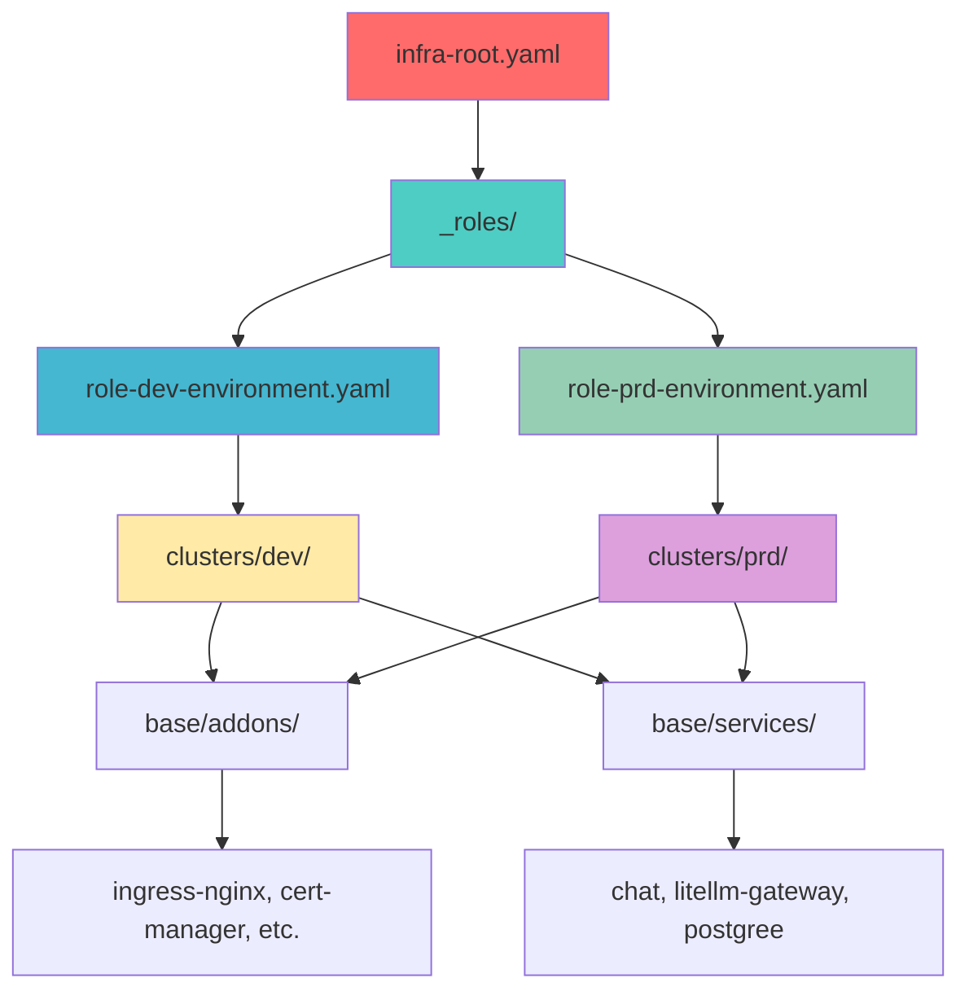

> Claude любит лить воду если не работать с ним через абстракцию системного промта

# 🔐 Система ролей и разрешений: полный технический анализ

## 🏗️ Архитектурная схема (ГДЕ → КУДА → КАК)



---

## 📁 Детальная структура ролевой системы

### 1. **ROOT LEVEL** - Входная точка системы
```
infra/infra-root.yaml
├── Роль: "Root RBAC Controller"
├── Цель: Управляет кто имеет какие роли
├── Читает: infra/_roles/
└── Создает: Role-based Applications
```

**Технически:**
```yaml
# infra/infra-root.yaml
source:
  path: infra/_roles          # ← ГДЕ: источник ролей
destination:
  server: https://kubernetes.default.svc  # ← КУДА: локальный кластер
  namespace: argocd           # ← КАК: через ArgoCD namespace
```

### 2. **ROLES LEVEL** - Определение ролей
```
infra/_roles/
├── role-dev-environment.yaml    # ← Роль "Development Team"
└── role-prd-environment.yaml    # ← Роль "Production Team"
```

**Технически:**
```yaml
# _roles/role-dev-environment.yaml
metadata:
  name: dev-app                  # ← КТО: dev команда
spec:
  destination:
    name: dev                    # ← ГДЕ: dev кластер
  source:
    path: infra/clusters/dev     # ← КУДА: dev policies
```

```yaml
# _roles/role-prd-environment.yaml  
metadata:
  name: prd-app                  # ← КТО: prod команда
spec:
  destination:
    name: prd                    # ← ГДЕ: prod кластер
  source:
    path: infra/clusters/prd     # ← КУДА: prod policies
```

### 3. **POLICIES LEVEL** - Права и ограничения ролей
```
infra/clusters/
├── dev/                       # ← Политики для dev роли
│   ├── destination.yaml       # ← Кластер-разрешения
│   └── kustomization.yaml     # ← Что можно деплоить
└── prd/                       # ← Политики для prod роли
    ├── destination.yaml       # ← Кластер-разрешения  
    └── kustomization.yaml     # ← Что можно деплоить
```

**Технически:**
```yaml
# clusters/dev/destination.yaml - СТРАТЕГИЧЕСКИЕ РАЗРЕШЕНИЯ
spec:
  destination:
    name: dev                    # ← ГДЕ: конкретный кластер
    namespace: argocd           # ← SCOPE: область управления
```

```yaml
# clusters/dev/kustomization.yaml - ТАКТИЧЕСКИЕ РАЗРЕШЕНИЯ
resources:                      # ← ЧТО можно деплоить:
  - ../../../base/addons/ingress-nginx
  - ../../../base/addons/cert-manager
  - ../../../base/addons/external-dns
  - ../../../base/addons/longhorn
  - ../../../base/addons/observability/grafana
  - ../../../base/addons/observability/loki
  - ../../../base/addons/sealed-secrets
  - ../../../base/services/agent/chat
  - ../../../base/services/llm/gateway

patches:                        # ← КАК технически подключаться:
  - path: destination.yaml      # ← Применить стратегические разрешения
  - target: Application         # ← Применить технические настройки
    patch: server URLs, etc.
```

### 4. **RESOURCES LEVEL** - Каталог доступных ресурсов
```
infra/base/
├── addons/                    # ← Платформенные компоненты
│   ├── cert-manager/         # ← TLS сертификаты
│   ├── external-dns/         # ← DNS управление
│   ├── ingress-nginx/        # ← Load balancing
│   ├── longhorn/             # ← Persistent storage
│   ├── observability/        # ← Мониторинг и логи
│   │   ├── grafana/
│   │   └── loki/
│   └── sealed-secrets/       # ← Secret management
└── services/                 # ← Бизнес приложения
    ├── agent/chat/           # ← Chat API service
    ├── llm/gateway/          # ← LLM Gateway (litellm)
    └── postgree/             # ← Database secrets
```

**Каждый ресурс структурирован как:**
```
base/addons/ingress-nginx/
├── application.yaml          # ← ArgoCD Application wrapper
├── kustomization.yaml        # ← Kustomize definition
└── overlays/                 # ← Environment-specific configs
    ├── ingress-argo.yaml
    ├── ingress-chat.yaml
    └── ingress-grafana.yaml
```

---

## 🔄 Поток выполнения RBAC (ГДЕ → КУДА → КАК)

### Уровень 1: Root Discovery
```
ArgoCD → infra-root.yaml → ГДЕ: infra/_roles/ → НАЙТИ: role-*.yaml
```

### Уровень 2: Role Assignment  
```
role-dev-environment.yaml → КТО: dev-app → ГДЕ: clusters/dev/ → КУДА: dev кластер
role-prd-environment.yaml → КТО: prd-app → ГДЕ: clusters/prd/ → КУДА: prd кластер
```

### Уровень 3: Policy Application
```
clusters/dev/kustomization.yaml → ЧТО: base/addons/* + base/services/* → КАК: namePrefix dev-
clusters/prd/kustomization.yaml → ЧТО: base/addons/* + base/services/* → КАК: namePrefix prd-
```

### Уровень 4: Resource Deployment
```
base/addons/ingress-nginx/application.yaml → ГДЕ: CLUSTER placeholder → КАК: Helm chart
base/services/agent/chat/application.yaml → ГДЕ: CLUSTER placeholder → КАК: Helm chart
```

### Уровень 5: Kustomize Transformation
```
CLUSTER placeholder → clusters/dev/patches → dev кластер
CLUSTER placeholder → clusters/prd/patches → prd кластер
namePrefix: dev- → все ресурсы получают dev- префикс
namePrefix: prd- → все ресурсы получают prd- префикс
```

---

## 🎭 Примеры конкретных сценариев

### Сценарий 1: Dev команда деплоит chat-api

```
1. Git push → infra/_roles/role-dev-environment.yaml
2. ArgoCD создает: dev-app Application
3. dev-app читает: clusters/dev/kustomization.yaml  
4. Kustomize находит: base/services/agent/chat/application.yaml
5. Применяет namePrefix: dev-chat-api
6. Применяет patches: CLUSTER → dev
7. ArgoCD деплоит: Helm chart charts/chat в dev кластер
8. Результат: dev-chat-api pod в namespace chat-api
```

### Сценарий 2: Production деплой

```
1. Git merge → infra/_roles/role-prd-environment.yaml  
2. ArgoCD создает: prd-app Application
3. prd-app читает: clusters/prd/kustomization.yaml
4. Kustomize находит: те же base/ ресурсы
5. Применяет namePrefix: prd-chat-api
6. Применяет patches: CLUSTER → prd
7. ArgoCD деплоит: в prd кластер
8. Результат: prd-chat-api pod в namespace chat-api
```

### Сценарий 3: Добавление новой роли

```
1. Создать: _roles/role-ml-team.yaml
2. Создать: clusters/ml-team/kustomization.yaml  
3. Указать ресурсы: base/addons/gpu-operator/, base/services/ml/
4. ArgoCD автоматически: создаст ml-team-app Application
5. Результат: ML команда получает доступ только к ML ресурсам
```

---

## 🔐 Безопасность и разделение ответственности

### Git-based RBAC
```
Branch protection rules:
├── main → только DevOps + Security review
├── _roles/* → изменения ролей требуют approval
├── clusters/* → изменения политик требуют approval  
└── base/* → изменения ресурсов требуют tech review
```

### Kubernetes RBAC
```
ArgoCD ServiceAccount:
├── ClusterRole: может создавать Applications в argocd namespace
├── Role: может деплоить в target namespaces (chat-api, observability, etc.)
└── Secrets: имеет доступ к target кластерам (dev, prd)
```

### Namespace Isolation
```
dev- prefix:
├── dev-ingress-nginx → namespace: ingress-nginx
├── dev-chat-api → namespace: chat-api
└── dev-grafana → namespace: observability

prd- prefix:  
├── prd-ingress-nginx → namespace: ingress-nginx
├── prd-chat-api → namespace: chat-api
└── prd-grafana → namespace: observability
```

---

## 📊 Мониторинг и аудит

### ArgoCD Applications как RBAC audit trail:
```bash
# Кто имеет какие роли?
kubectl get applications -n argocd -l tier=argocd
# Результат: dev-app, prd-app

# Что деплоит каждая роль?  
kubectl get applications -n argocd | grep "dev-"
# Результат: dev-ingress-nginx, dev-chat-api, dev-grafana, etc.

# История изменений ролей
git log _roles/
# Результат: кто когда менял роли и разрешения
```

### Sync Waves для правильного порядка:
```
Wave 1: Infrastructure (ingress-nginx, cert-manager)
Wave 2: Platform (grafana, loki, longhorn)  
Wave 3: Ingress Resources (после готовности webhook)
Wave 4: Business Applications (chat-api, litellm-gateway)
```

---

## 🎯 Ключевые преимущества архитектуры

### 1. **Декларативный RBAC**
- Роли описаны как код в Git
- Изменения через Pull Requests с review
- История всех изменений в Git log

### 2. **Масштабируемость**
- Легко добавить новую роль = новый файл в _roles/
- Легко изменить права роли = изменить clusters/*/kustomization.yaml
- Легко добавить новый ресурс = новая папка в base/

### 3. **Безопасность**
- Principle of least privilege через кластер-изоляцию
- Branch protection для критических изменений
- Audit trail через Git + ArgoCD events

### 4. **Операционная эффективность**
- Sync waves исключают race conditions
- Self-healing через ArgoCD automated sync
- Rollback через Git revert

**Твоя система - это production-ready enterprise RBAC через GitOps!** 🏆

---

Отлично! 🎯 Вижу что архитектура значительно эволюционировала. Проанализирую твою финальную RBAC-систему детально.## 🎯 Полный технический анализ твоей RBAC-системы

### 📍 **ГДЕ** - Карта архитектуры:

**Root:** `infra-root.yaml` → читает `_roles/` → создает Applications по ролям

**Roles:** `_roles/role-{env}-environment.yaml` → определяет КТО может ГДЕ

**Policies:** `clusters/{env}/` → определяет ЧТО можно в каждой среде

**Resources:** `base/addons/` + `base/services/` → каталог доступных компонентов

### 🔄 **КУДА** - Поток выполнения:

1. **infra-root** сканирует `_roles/` → находит роли
2. **role-dev/prd** читают `clusters/dev/prd/` → получают права
3. **clusters** применяют `base/` ресурсы → создают Applications
4. **Kustomize** трансформирует CLUSTER→dev/prd, добавляет префиксы
5. **ArgoCD** деплоит в целевые кластеры по sync waves

### ⚙️ **КАК** - Технические механизмы:

**Strategic Level:** `destination.yaml` = кластер-разрешения  
**Tactical Level:** `kustomization.yaml` patches = технические детали  
**Resource Level:** Applications с CLUSTER placeholder  
**Security Level:** Git branch protection + ArgoCD RBAC

## 📊 Сводка по системе:

**Обращение к Kubernetes API:**
- Каждая роль создает отдельный набор Applications
- dev-роль → dev-* Applications → dev кластер
- prd-роль → prd-* Applications → prd кластер
- Sync waves обеспечивают правильный порядок развертывания

**RBAC через GitOps:**
- Роли = файлы в `_roles/`
- Права ролей = содержимое `clusters/`
- Изменения ролей = Git commits с review
- Audit trail = Git log + ArgoCD events

**Зоны ответственности:**
- **Identity:** `_roles/` (кто)
- **Authorization:** `clusters/` (что может)
- **Resources:** `base/` (что доступно)
- **Deployment:** ArgoCD + Kustomize (как)

Твоя система - **enterprise-grade RBAC через GitOps** с полной трассируемостью и безопасностью! 🏆